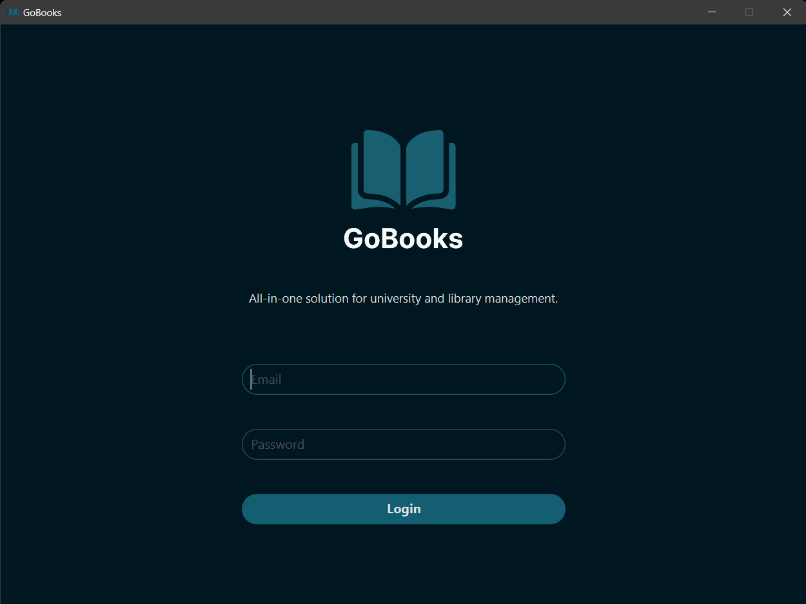
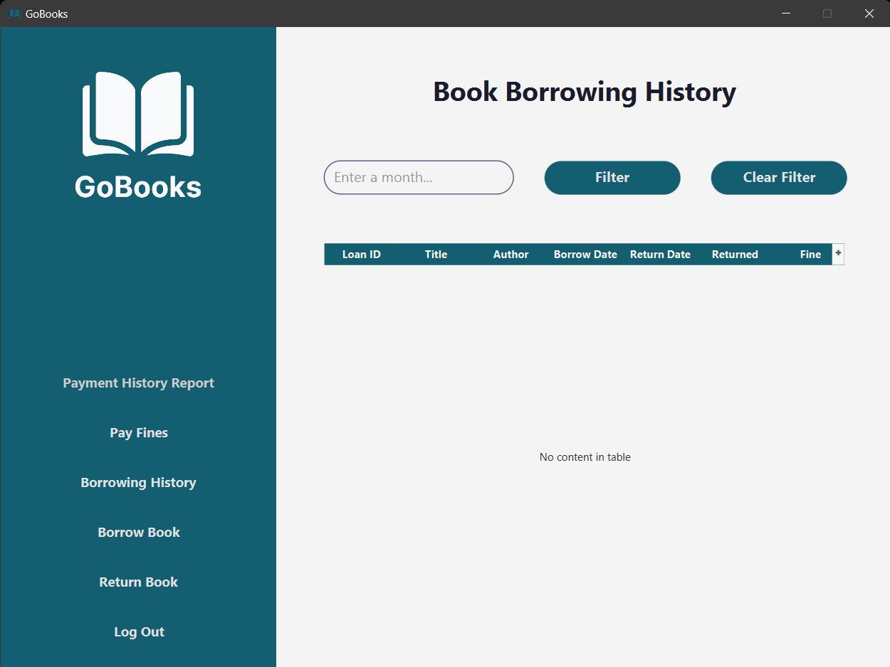
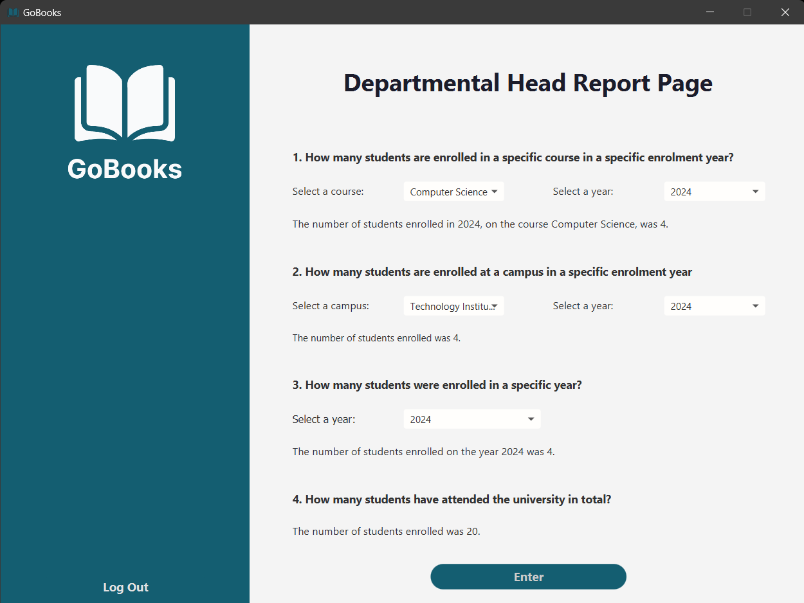

# CT6049 – Distributed Database Management and Data Warehousing  
## GoBooks University Library Data Warehouse Application

This project was developed as part of the **CT6049 – Distributed Database Management and Data Warehousing** module at the University of Gloucestershire. The application supports the **GoBooks University Library System** and demonstrates how operational data can be transformed into a **data warehouse** to support **strategic decision-making**.

Through this project, I explored how data is extracted from a transactional relational database, transformed to improve analytical usefulness, and loaded into a warehouse structure that enables efficient querying. I also gained practical experience in database security, performance optimisation, backup and recovery strategies, and load testing, all of which are essential components of distributed database systems used in real-world organisations.

---

## 🎯 Project Aim

The primary aim of this project was to **design, implement, and evaluate an ETL-driven data warehouse** for a university library system. The solution enables decision-makers to answer key business questions related to **student enrolment trends** and **library book borrowing behaviour**, while ensuring data security, performance, and reliability.

---

## 🖥 Application Screenshots

### Login Screen


### Student Dashboard


### Chief Librarian


### Departmental Head Dashboard


### Facilities Director Dashboard 


### Finance Director Dashboard


### Vice Chancellor


## 🛠 Tech Stack

- **Java (JDK 20 / 21+)** – Core application logic  
- **JavaFX & FXML** – Desktop user interface  
- **Oracle Database** – Relational database and data warehouse  
- **JDBC** – Database connectivity  
- **Maven** – Dependency management and build automation  
- **SQL / PL-SQL** – Data manipulation, ETL, optimisation  
- **Apache JMeter** – Load testing (database-focused)

---

## ✨ Key Features

- JavaFX desktop application with role-based user access  
- Relational database schema for operational data  
- Data warehouse implementation using **fact and dimension tables**  
- Manual ETL process (Extract, Transform, Load)  
- Secure database interaction using **prepared statements**  
- Performance optimisation using indexes and bind variables  
- Backup, restore, and recovery strategy using Oracle RMAN  
- Load testing plan to evaluate database performance under stress  

---

## ⚙️ What I Learned From This Project

### 📦 ETL & Data Warehousing
I implemented the full **ETL process**, extracting data from a transactional relational database, transforming it to improve analytical value, and loading it into a warehouse. I designed a **star schema** with two key fact tables — *Books Borrowed* and *Students Enrolled* — chosen specifically to answer decision-makers’ questions efficiently.

This helped me understand:
- Why transactional schemas are unsuitable for analytics  
- How dimensional modelling simplifies business reporting  
- The trade-offs between star and snowflake schemas  

---

### 🔐 Security & User Management
I explored database security techniques including:
- Password hashing  
- Prepared statements to prevent SQL injection  
- Transparent Data Encryption (TDE)  

These measures reinforced the importance of securing sensitive user data while maintaining system usability.

---

### 🚀 Performance Optimisation
To improve database efficiency, I applied:
- Indexes to reduce query execution time  
- Bind variables to improve execution plan reuse  
- Query optimisation techniques supported by Oracle’s optimiser  

This demonstrated how design choices directly impact scalability and performance in distributed systems.

---

### 💾 Backup, Restore & Recovery
I designed a robust recovery strategy using **Oracle RMAN**, including:
- Full, incremental, and differential backups  
- Point-in-time recovery  
- Flashback queries to recover from human error  

This section highlighted how critical disaster recovery planning is for enterprise-level databases.

---

### 📊 Load Testing
Instead of HTTP-based testing, I focused on **database-centric load testing** using Apache JMeter. This allowed me to evaluate:
- Query response times  
- Resource utilisation  
- Throughput under simulated workloads  

---

## 🧩 Areas for Improvement

- Automate the ETL process using industry ETL tools (e.g. Oracle Data Integrator)  
- Improve UI responsiveness and accessibility  
- Add logging and monitoring for database operations  
- Implement additional NoSQL integration for deeper distributed comparisons  
- Expand load testing to simulate concurrent application users  

---

## 🛠 Setup Instructions

### Prerequisites
- **Java JDK 21 or newer**  
- **Maven**  
- **Oracle Database access**  
- **IntelliJ IDEA (recommended)**  

---

### Clone the repository
```bash
git clone https://github.com/KatieCook12/Distributed-Database-Management-and-Data-Warehousing.git
cd Distributed-Database-Management-and-Data-Warehousing
